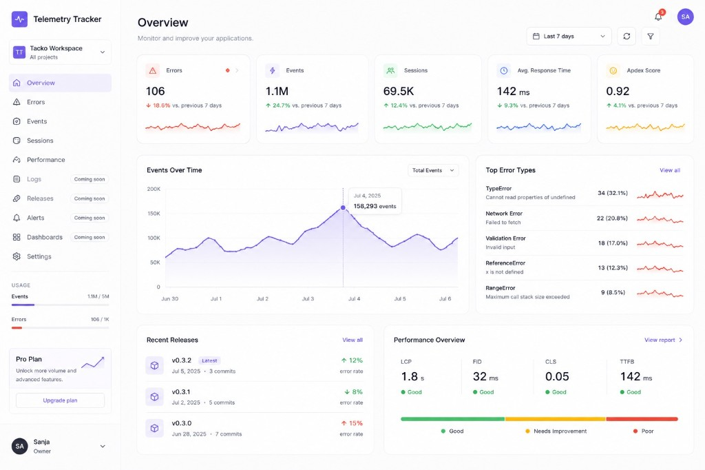
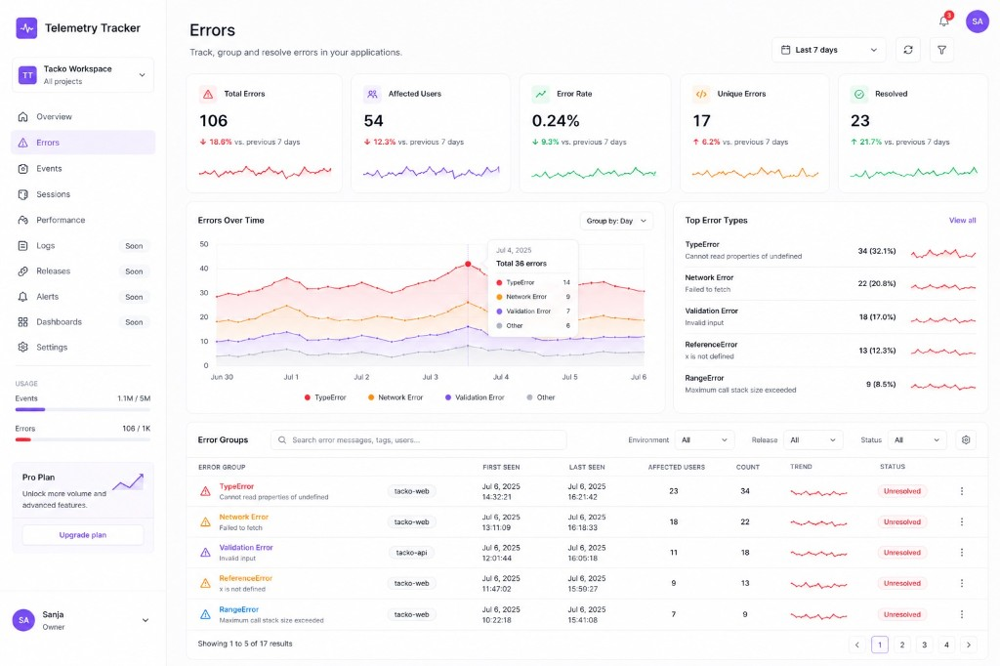

🇬🇧 English: [README.md](README.md)
🇪🇸 Español: [README.es.md](README.es.md)
# Telemetry Tracker


[](https://www.npmjs.com/package/@telemetry-tracker/core)
[](https://www.npmjs.com/package/@telemetry-tracker/core)

<p align="center">
  <strong>Open-source Fehlerverfolgung, Produktanalyse, und Sitzungstelemetrie.</strong>
</p>

<p align="center">
  Entweder ressourcenschonend und self-hosted für die eigene Infrastruktur — oder über den <strong>offiziellen Cloud-Dienst</strong> bei
  <a href="https://telemetry-tracker.com">telemetry-tracker.com</a> über Stripe (EUR).
</p>

<p align="center">
  <a href="https://telemetry-tracker.com">
    <picture>
      <source media="(prefers-color-scheme: dark)" srcset="apps/dashboard/public/screenshot-dashboard-dark.png" />
      
    </picture>
  </a>
</p>

<p align="center">
  <sub><strong>Übersicht</strong> — KPI-Karten, Event-Trends, häufigste Fehler, Releases und Performance-Daten (Hell-/Dunkelmodus).</sub>
</p>

<p align="center">
  <picture>
    <source media="(prefers-color-scheme: dark)" srcset="apps/dashboard/public/screenshot-errors-dark.png" />
    
  </picture>
</p>

<p align="center">
  <sub><strong>Fehler</strong> — KPIs, Trends nach Typ, häufigste Fehler und eine filterbare, gruppierte Fehlertabelle (Hell-/Dunkelmodus).</sub>
</p>

---

## Funktionen

| Funktion | Unterstützung |
|---------|-----------|
| Fehler | ✅ |
| Events | ✅ |
| Sessions | ✅ |
| Organisationen | ✅ |
| Projekte | ✅ |
| API-Keys | ✅ |
| Dashboard | ✅ |
| REST API | ✅ |
| SDKs (`@telemetry-tracker/*`) | ✅ |
| Self-hosted | ✅ |
| Hosted cloud ([telemetry-tracker.com](https://telemetry-tracker.com)) | ✅ |
| Zahlungspläne (Free / Pro / Business, in EUR) | ✅ |
| Benachrichtigungen | ✅ |
| Source Maps | ✅ |

Self-Hosting-Einrichtung: [DEPLOYMENT.md](DEPLOYMENT.md)

---

## Warum Telemetry Tracker?

Telemetry Tracker bietet die wichtigsten Funktionen, die die meisten Anwendungen benötigen – Fehlerverfolgung, Produktanalyse-Ereignisse und Sitzungs-Telemetrie – ohne die Komplexität von Enterprise-Observability-Plattformen.

* Self-hosted für eigene Anwendungen
* Offizielle gehostete Cloud mit Abrechnung in Euro (EUR)
* Ressourcenschonend
* Einfache APIs
* Open Source ([MIT](LICENSE))
* Einfach bereitzustellen ([DEPLOYMENT.md](DEPLOYMENT.md))

---

## Architektur

```
Client SDK
    ↓  Datenaufnahme (API key)
   API  ←──  Dashboard (Sitzungsauthentifizierung)
    ↓
 PostgreSQL
```

Anwendungen senden Fehler, Ereignisse und Sitzungen über `@telemetry-tracker/*` an die **API**. Das **Dashboard** liest die Telemetriedaten über dieselbe API – niemals direkt aus der Datenbank.


---

## 🚀 Installation

Lokale Telemetry-Tracker-Installation in weniger als 5 Minuten.

**Voraussetzungen:** Node.js 18+, pnpm 9, PostgreSQL 16 (oder Docker).

```bash
git clone https://github.com/Telemetry-Tracker/telemetry-tracker.git
cd telemetry-tracker
pnpm install
docker compose up -d
cp apps/api/.env.example apps/api/.env
cp apps/dashboard/.env.example apps/dashboard/.env
pnpm db:migrate
```

In zwei Konsolen:

```bash
pnpm dev:api        # API → http://localhost:3001
pnpm dev:dashboard  # Dashboard → http://localhost:3000
```

Danach:

1. Öffne **http://localhost:3000**, klicke **Start tracking**, und erstelle einen Account.
2. Erstelle eine **Organisation** und ein **Projekt** in den Organisationseinstellungen.
3. Erstelle einen **API-Key** unter Settings → API-keys (kopiere den `tt_live_…` secret einmalig).
4. Benutze deine App (siehe SDK-Beispiel) und überprüfe **Overview** im Dashboard.

---

## SDK

Kompatibel mit:

- ✓ **React / Vue** — `@telemetry-tracker/core`
- ✓ **Next.js** — `@telemetry-tracker/next`
- ✓ **Node / NestJS** — `@telemetry-tracker/node`
- ✓ **Nuxt** — `@telemetry-tracker/core` ([Anleitung](docs/sdk-nuxt.md)) 
- ✓ **React Native** — `@telemetry-tracker/react-native`
- ✓ **Vanilla JS** — `@telemetry-tracker/core`

Anleitungen [core](docs/sdk-core.md) · [Next.js](docs/sdk-next.md) · [Node](docs/sdk-node.md) · [NestJS](docs/sdk-nestjs.md) · [Vue](docs/sdk-vue.md) · [Nuxt](docs/sdk-nuxt.md) · [React Native](docs/sdk-react-native.md)

### Beispiel

Mit npm installieren:

```bash
pnpm add @telemetry-tracker/core
```

```ts
import { init, trackEvent, trackError } from "@telemetry-tracker/core";

init({
  ingestUrl: "http://localhost:3001",
  app: "my-app",
  apiKey: process.env.TELEMETRY_API_KEY!, // tt_live_… vom Dashboard
  environment: "development",
});

trackEvent("user_registered");
trackError(new Error("Something broke"));
```

---

## 🏗 Projektstruktur

```
apps/
  api/          # Fastify ingest + read API, Prisma, auth, billing
  dashboard/    # Next.js UI

packages/
  telemetry-core/
  telemetry-node/
  telemetry-next/
  telemetry-react-native/
```

---

## Erstellt mit

- [Next.js](https://nextjs.org/) — Dashboard
- [Fastify](https://fastify.dev/) — API
- [Prisma](https://www.prisma.io/) — ORM & migrations
- [PostgreSQL](https://www.postgresql.org/) — Datenbank
- [TypeScript](https://www.typescriptlang.org/)
- [pnpm](https://pnpm.io/) — Monorepo
- [Docker](https://www.docker.com/) — Lokale Entwicklung (Postgres über `docker compose`; Dashboard-Produktions-image)

---

## Ablaufplan

Die bereits verfügbaren Funktionen befinden sich oben unter **[Features](#features)**. Im Folgenden werden **geplante und in Entwicklung befindliche Arbeiten** aufgeführt, kein Veröffentlichungsplan. Elemente, die im Dashboard als *Coming soon* gekennzeichnet sind, entsprechen dieser Liste ([#96](https://github.com/Telemetry-Tracker/telemetry-tracker/issues/96)).

| Status | Erklärung |
|--------|---------|
| **Geplant** | In einer GitHub-Issue definiert oder erfasst |
| **In Entwicklung** | Als *Coming soon* gekennzeichnet; Zeitpunkt und Umfang noch offen |

<details>
<summary><strong>Geplant & in Entwicklung</strong> (11 Bereiche — Observierung, Plattform, Konto)</summary>

### Observierung

| Bereich | Status |
|---------|--------|
| [Performance / Web Vitals](https://github.com/Telemetry-Tracker/telemetry-tracker/issues/99) | Geplant |
| Traces | In Entwicklung |
| Logs | In Entwicklung |

### Plattform

| Bereich | Status |
|---------|--------|
| Benutzerdefinierte Dashboards | Geplant |
| Releases | In Entwicklung |
| Feature Flags | In Entwicklung |
| Exportberichte | In Entwicklung |

### Konto & Organisation

| Bereich | Status |
|---------|--------|
| Team-Audit-Protokoll | Geplant |
| Integrationen | In Entwicklung |
| Profil, Einstellungen & Sicherheit | In Entwicklung |

</details>

Sie haben eine Idee? [Feature vorschlagen](https://github.com/Telemetry-Tracker/telemetry-tracker/issues/new?template=feature_request.md).

---

## 🤝 Beiträge

Beiträge sind willkommen! Lies [CONTRIBUTING.md](CONTRIBUTING.md) für ein lokales Setup und welche CI-Workflows ausgeführt werden.

Gute Einstiegspunkte:

- [**Good first issues**](https://github.com/Telemetry-Tracker/telemetry-tracker/issues?q=is%3Aissue+is%3Aopen+label%3A%22good+first+issue%22)
- [help wanted](https://github.com/Telemetry-Tracker/telemetry-tracker/issues?q=is%3Aissue+is%3Aopen+label%3A%22help+wanted%22) issues

Bitte befolgen Sie den [Code of Conduct](CODE_OF_CONDUCT.md). Melden Sie Sicherheitslücken via [SECURITY.md](SECURITY.md)—nicht über öffentliche issues.

---

## 📚 Dokumentation

| Thema | Dokumentation |
|-------|---------------|
| Architekturübersicht | [docs/ARCHITECTURE.md](docs/ARCHITECTURE.md) |
| Bereitstellung (Übersicht) | [DEPLOYMENT.md](DEPLOYMENT.md) |
| Railway-Einrichtung & Fehlerbehebung | [docs/RAILWAY.md](docs/RAILWAY.md) |
| Stripe & Resend (optional) | [docs/BILLING.md](docs/BILLING.md) |
| Checkliste für den Produktivbetrieb | [docs/PRODUCTION-READINESS.md](docs/PRODUCTION-READINESS.md) |
| Releases & Bereitstellungsleitfaden | [docs/RELEASE.md](docs/RELEASE.md) |
| Änderungsprotokoll | [CHANGELOG.md](CHANGELOG.md) |
| RBAC & Organisationsmodell | [docs/RBAC.md](docs/RBAC.md) |
| Tarife & Ingest-Authentifizierung | [docs/ENTITLEMENTS.md](docs/ENTITLEMENTS.md) |
| SDK-Anleitungen | [docs/sdk-core.md](docs/sdk-core.md), [docs/sdk-next.md](docs/sdk-next.md), [docs/sdk-node.md](docs/sdk-node.md), [docs/sdk-nestjs.md](docs/sdk-nestjs.md), [docs/sdk-vue.md](docs/sdk-vue.md), [docs/sdk-nuxt.md](docs/sdk-nuxt.md), [docs/sdk-react-native.md](docs/sdk-react-native.md) |
| Source Maps | [docs/source-maps.md](docs/source-maps.md) |

**SDK-Pakete veröffentlichen:** `npm login` → `pnpm publish:packages` (siehe [CONTRIBUTING.md](CONTRIBUTING.md) und die Skripte in der `package.json` im Hauptverzeichnis).

**GitHub Social Preview:** Unter **Repository → Settings → General → Social preview** `https://telemetry-tracker.com/og-banner.png` verwenden (1024×409 Marketing-Banner), sobald das Dashboard bereitgestellt wurde. Installationspfad für Dokumentation und Marketing: `@telemetry-tracker/core` (siehe npm-Badges oben).

---

## ❤️ Unterstütze das Projekt

Wenn Sie Telemetry Tracker hilfreich finden:

- ⭐ Geben Sie diesem Projekt einen Stern
- 🐛 [Fehler Melden](https://github.com/Telemetry-Tracker/telemetry-tracker/issues/new?template=bug_report.md)
- 💡 [Features empfehlen](https://github.com/Telemetry-Tracker/telemetry-tracker/issues/new?template=feature_request.md)
- 🤝 Öffnen eines pull requests

---

## 📄 Lizenz, Markenrecht & Hosting

### Software (MIT)

Der **Quellcode** dieses Projekts ist unter der [MIT-Lizenz](LICENSE) lizenziert. Du darfst die Software unter diesen Bedingungen verwenden, verändern, selbst hosten und weiterverbreiten, einschließlich des Copyright-Hinweises in den von dir verbreiteten Kopien.

Die MIT-Lizenz deckt das **Urheberrecht am Quellcode** ab. Sie gewährt keine Rechte zur Nutzung des Namens oder der Marke **Telemetry Tracker** in einer Weise, die den Eindruck erweckt, dass Tacko deinen Dienst betreibt oder unterstützt. Siehe [TRADEMARK.md](TRADEMARK.md).

### Self-Hosting

Du darfst Telemetry Tracker auf einer von dir kontrollierten Infrastruktur für deine eigenen Anwendungen betreiben – hierfür ist unter der MIT-Lizenz keine gesonderte Genehmigung erforderlich.

### Offiziell gehostete Cloud

Der **verwaltete Dienst** unter [telemetry-tracker.com](https://telemetry-tracker.com) wird von [Tacko](https://tacko.io) betrieben. Die Tarife **Pro** und **Business** werden dort über Stripe in **EUR** abgerechnet.

### Marke & konkurrierende gehostete Dienste

Biete keinen mandantenfähigen Hosting-Dienst **für Dritte** unter dem Namen, Logo oder Marketing von **Telemetry Tracker** an, als wäre es das offizielle Produkt. Forks und interne Bereitstellungen sollten einen **eigenständigen Namen** verwenden, sofern du keine schriftliche Genehmigung von Tacko hast.

Details und Beispiele: **[TRADEMARK.md](TRADEMARK.md)** · Partnerschaften: [info@tacko.io](mailto:info@tacko.io)
