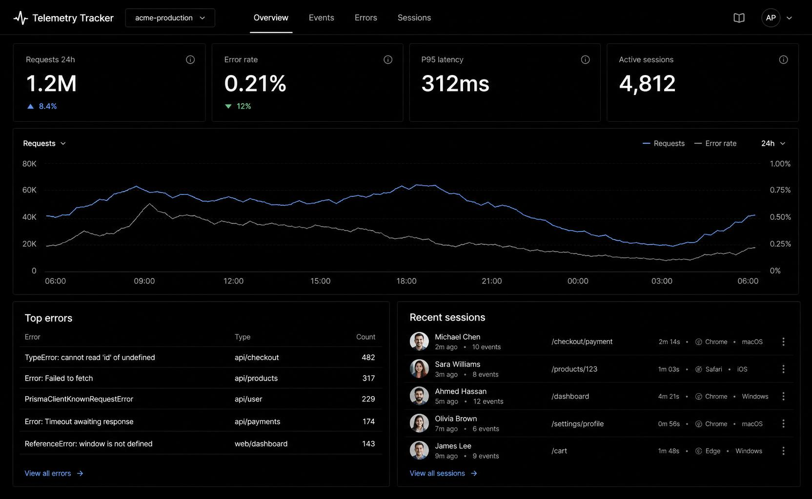
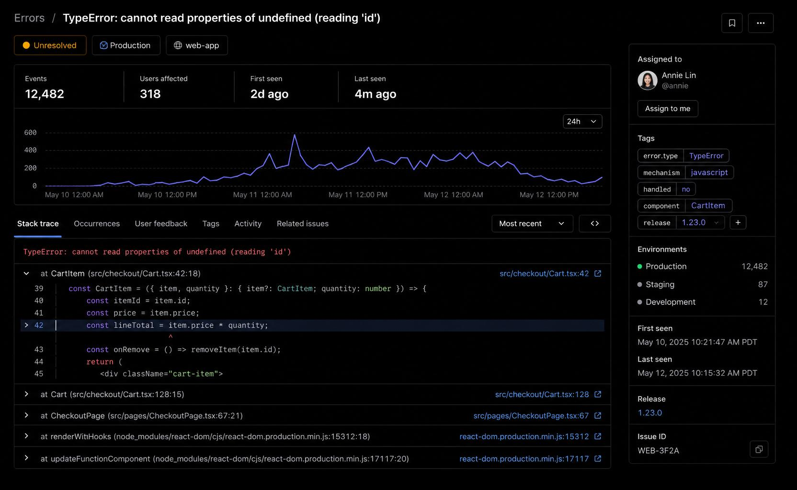

# Telemetry Tracker


[](https://www.npmjs.com/package/@telemetry-tracker/core)
[](https://www.npmjs.com/package/@telemetry-tracker/core)

<p align="center">
  <strong>Open-source error tracking, product analytics, and session telemetry.</strong>
</p>

<p align="center">
  Lightweight and self-hosted for your own infrastructure—or use the <strong>official hosted cloud</strong> at
  <a href="https://telemetry-tracker.com">telemetry-tracker.com</a> with Stripe billing (EUR).
</p>

<p align="center">
  <a href="https://telemetry-tracker.com">
    
  </a>
</p>

<p align="center">
  <sub><strong>Overview</strong> — trend charts, top errors, and recent sessions filtered by app and time range.</sub>
</p>

<p align="center">
  
</p>

<p align="center">
  <sub><strong>Error detail</strong> — grouped exceptions with stack traces, occurrence context, and release tags.</sub>
</p>

---

## Features

| Feature | Supported |
|---------|-----------|
| Errors | ✅ |
| Events | ✅ |
| Sessions | ✅ |
| Organizations | ✅ |
| Projects | ✅ |
| API keys | ✅ |
| Dashboard | ✅ |
| REST API | ✅ |
| SDKs (`@telemetry-tracker/*`) | ✅ |
| Self-hosted | ✅ |
| Hosted cloud ([telemetry-tracker.com](https://telemetry-tracker.com)) | ✅ |
| Paid plans (Free / Pro / Business, EUR via Stripe) | ✅ |
| Alerting | ✅ |
| Source maps | ✅ |

Self-host setup: [DEPLOYMENT.md](DEPLOYMENT.md)

---

## Why Telemetry Tracker?

Telemetry Tracker provides the core building blocks most applications need—error tracking, product analytics events and session telemetry—without the complexity of enterprise observability platforms.

- Self-hosted for your own products
- Official hosted cloud with EUR billing
- Lightweight
- Simple APIs
- Open source ([MIT](LICENSE))
- Easy to deploy ([DEPLOYMENT.md](DEPLOYMENT.md))

---

## Architecture

```
Client SDK
    ↓  ingest (API key)
   API  ←──  Dashboard (session auth)
    ↓
 PostgreSQL
```

Apps send errors, events, and sessions to the **API** via `@telemetry-tracker/*`. The **dashboard** reads telemetry through the same API—never directly from the database.

---

## 🚀 Quick Start

Get Telemetry Tracker running locally in under 5 minutes.

**Prerequisites:** Node.js 18+, pnpm 9, PostgreSQL 16 (Docker works).

```bash
git clone https://github.com/Telemetry-Tracker/telemetry-tracker.git
cd telemetry-tracker
pnpm install
docker compose up -d
cp apps/api/.env.example apps/api/.env
cp apps/dashboard/.env.example apps/dashboard/.env
pnpm db:migrate
```

In two terminals:

```bash
pnpm dev:api        # API → http://localhost:3001
pnpm dev:dashboard  # Dashboard → http://localhost:3000
```

Then:

1. Open **http://localhost:3000**, click **Start tracking**, and create an account.
2. Create an **organization** and **project** in Organization settings.
3. Create an **API key** under Settings → API keys (copy the `tt_live_…` secret once).
4. Instrument your app (see SDK example below) and check **Overview** in the dashboard.

---

## SDK

Works with:

- ✓ **React / Vue** — `@telemetry-tracker/core`
- ✓ **Next.js** — `@telemetry-tracker/next`
- ✓ **Node / NestJS** — `@telemetry-tracker/node`
- ✓ **Nuxt** — `@telemetry-tracker/core` ([guide](docs/sdk-nuxt.md))
- ✓ **React Native** — `@telemetry-tracker/react-native`
- ✓ **Vanilla JS** — `@telemetry-tracker/core`

Guides: [core](docs/sdk-core.md) · [Next.js](docs/sdk-next.md) · [Node](docs/sdk-node.md) · [NestJS](docs/sdk-nestjs.md) · [Vue](docs/sdk-vue.md) · [Nuxt](docs/sdk-nuxt.md) · [React Native](docs/sdk-react-native.md)

### Example

Install from npm:

```bash
pnpm add @telemetry-tracker/core
```

```ts
import { init, trackEvent, trackError } from "@telemetry-tracker/core";

init({
  ingestUrl: "http://localhost:3001",
  app: "my-app",
  apiKey: process.env.TELEMETRY_API_KEY!, // tt_live_… from dashboard
  environment: "development",
});

trackEvent("user_registered");
trackError(new Error("Something broke"));
```

---

## 🏗 Project Structure

```
apps/
  api/          # Fastify ingest + read API, Prisma, auth, billing
  dashboard/    # Next.js UI

packages/
  telemetry-core/
  telemetry-node/
  telemetry-next/
  telemetry-react-native/
```

---

## Built With

- [Next.js](https://nextjs.org/) — dashboard
- [Fastify](https://fastify.dev/) — API
- [Prisma](https://www.prisma.io/) — ORM & migrations
- [PostgreSQL](https://www.postgresql.org/) — database
- [TypeScript](https://www.typescriptlang.org/)
- [pnpm](https://pnpm.io/) — monorepo
- [Docker](https://www.docker.com/) — local development (Postgres via `docker compose`; dashboard production image)

---

## Roadmap

Shipped capabilities are in **[Features](#features)** above. What follows is **planned and exploring work**—grouped by area, not a release schedule. Items marked *Coming soon* in the dashboard match this list ([#96](https://github.com/Telemetry-Tracker/telemetry-tracker/issues/96)).

| Status | Meaning |
|--------|---------|
| **Planned** | Scoped or tracked in a GitHub issue |
| **Exploring** | Labeled *Coming soon* in the product; timing and scope TBD |

<details>
<summary><strong>Planned & exploring</strong> (11 areas — Observability, Platform, Account)</summary>

### Observability

| Area | Status |
|------|--------|
| [Performance / Web Vitals](https://github.com/Telemetry-Tracker/telemetry-tracker/issues/99) | Planned |
| Traces | Exploring |
| Logs | Exploring |

### Platform

| Area | Status |
|------|--------|
| Custom dashboards | Planned |
| Releases | Exploring |
| Feature flags | Exploring |
| Export reports | Exploring |

### Account & organization

| Area | Status |
|------|--------|
| Team audit log | Planned |
| Integrations | Exploring |
| Profile, preferences & security | Exploring |

</details>

Have an idea? [Open a feature request](https://github.com/Telemetry-Tracker/telemetry-tracker/issues/new?template=feature_request.md).

---

## 🤝 Contributing

Contributions are welcome! Read [CONTRIBUTING.md](CONTRIBUTING.md) for local setup and what CI runs.

Good places to start:

- [**Good first issues**](https://github.com/Telemetry-Tracker/telemetry-tracker/issues?q=is%3Aissue+is%3Aopen+label%3A%22good+first+issue%22)
- [help wanted](https://github.com/Telemetry-Tracker/telemetry-tracker/issues?q=is%3Aissue+is%3Aopen+label%3A%22help+wanted%22) issues

Please follow the [Code of Conduct](CODE_OF_CONDUCT.md). Report security issues privately via [SECURITY.md](SECURITY.md)—not public issues.

---

## 📚 Documentation

| Topic | Doc |
|-------|-----|
| Architecture overview | [docs/ARCHITECTURE.md](docs/ARCHITECTURE.md) |
| Deploy (overview) | [DEPLOYMENT.md](DEPLOYMENT.md) |
| Railway setup & troubleshooting | [docs/RAILWAY.md](docs/RAILWAY.md) |
| Stripe & Resend (optional) | [docs/BILLING.md](docs/BILLING.md) |
| Production checklist | [docs/PRODUCTION-READINESS.md](docs/PRODUCTION-READINESS.md) |
| Releases & deploy runbook | [docs/RELEASE.md](docs/RELEASE.md) |
| Changelog | [CHANGELOG.md](CHANGELOG.md) |
| RBAC & org model | [docs/RBAC.md](docs/RBAC.md) |
| Plans & ingest auth | [docs/ENTITLEMENTS.md](docs/ENTITLEMENTS.md) |
| SDK guides | [docs/sdk-core.md](docs/sdk-core.md), [docs/sdk-next.md](docs/sdk-next.md), [docs/sdk-node.md](docs/sdk-node.md), [docs/sdk-nestjs.md](docs/sdk-nestjs.md), [docs/sdk-vue.md](docs/sdk-vue.md), [docs/sdk-nuxt.md](docs/sdk-nuxt.md), [docs/sdk-react-native.md](docs/sdk-react-native.md) |
| Source maps | [docs/source-maps.md](docs/source-maps.md) |

**Publish SDK packages:** `npm login` → `pnpm publish:packages` (see [CONTRIBUTING.md](CONTRIBUTING.md) and root `package.json` scripts).

**GitHub social preview:** In repo **Settings → General → Social preview**, use `https://telemetry-tracker.com/og-banner.png` (1024×409 marketing banner) once the dashboard is deployed. Install path for docs and marketing: `@telemetry-tracker/core` (see npm badges above).

---

## ❤️ Support the Project

If you find Telemetry Tracker useful:

- ⭐ Star this repository
- 🐛 [Report bugs](https://github.com/Telemetry-Tracker/telemetry-tracker/issues/new?template=bug_report.md)
- 💡 [Suggest features](https://github.com/Telemetry-Tracker/telemetry-tracker/issues/new?template=feature_request.md)
- 🤝 Open a pull request

---

## 📄 License, trademark & hosting

### Software (MIT)

This project’s **source code** is licensed under the [MIT License](LICENSE). You may use, modify, self-host, and distribute the software under those terms, including the copyright notice in copies you distribute.

MIT covers **copyright on the code**. It does not grant rights to use the **Telemetry Tracker** name or branding in ways that suggest Tacko operates or endorses your service. See [TRADEMARK.md](TRADEMARK.md).

### Self-hosting

You may run Telemetry Tracker on infrastructure you control for your own applications — no separate permission required under MIT.

### Official hosted cloud

The **managed service** at [telemetry-tracker.com](https://telemetry-tracker.com) is operated by [Tacko](https://tacko.io). **Pro** and **Business** plans there are billed in **EUR** via Stripe.

### Brand & competing hosted services

Do not offer a multi-tenant hosted service **to third parties** using the **Telemetry Tracker** name, logo, or marketing as if it were the official product. Forks and internal deployments should use a **distinct name** unless you have written permission from Tacko.

Details and examples: **[TRADEMARK.md](TRADEMARK.md)** · Partnerships: [info@tacko.io](mailto:info@tacko.io)
