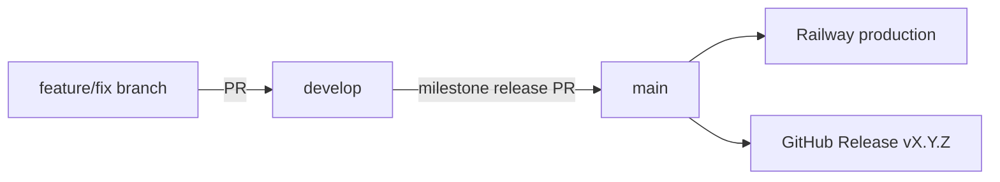

# Release and deployment process

This document describes how we integrate, release, and deploy **Telemetry Tracker** (API + dashboard). SDK packages (`@tacko/telemetry-*`) use separate semver in `packages/*/package.json` and `pnpm publish:packages` — see [README](../README.md#publishing-sdk-packages-to-npm).

User-facing changes are recorded in [CHANGELOG.md](../CHANGELOG.md).

---

## Branch model

| Branch | Role |
|--------|------|
| **`develop`** | Integration branch — feature PRs merge here; CI must pass |
| **`main`** | Production — official hosted cloud and semver GitHub Releases |
| **`feature/*`, `fix/*`** | Short-lived; open PRs against **`develop`** |



**Deploy ≠ release.** Railway production deploys from **`main`**. Self-hosters and GitHub Release consumers follow **semver tags** on `main`.

There is no separate staging deploy yet — validate on `develop` locally before milestone promotion.

### `main` merge gate

GitHub cannot require “your approval only when you are not the PR author” (authors cannot approve their own PRs). **`main`** uses:

| Rule | Mechanism |
|------|-----------|
| PR required | Branch protection |
| CI must pass | Required check: `build` |
| **Maintainer approval when author ≠ @unjica** | Required check: `maintainer-review` ([workflow](../.github/workflows/maintainer-review.yml)) |
| **Your own PRs to `main`** | `maintainer-review` passes automatically; merge after `build` is green |
| Review requests | [CODEOWNERS](../.github/CODEOWNERS) notifies @unjica on PRs to `main` |

After the maintainer-review workflow is on **`main`**, add `maintainer-review` to required status checks (Settings → Branches → `main`, or maintainer API update).

---

## Release cadence

Releases are **milestone-driven**:

1. Track work in a GitHub milestone (e.g. “v1.2 — …”).
2. Merge completed work into **`develop`**; keep [CHANGELOG.md](../CHANGELOG.md) `[Unreleased]` up to date.
3. When the milestone is complete and CI is green, promote **`develop` → `main`** (release PR or fast-forward).
4. Tag **`main`**, publish GitHub Release, migrate production DB, verify deploy.
5. **Sync `develop` with `main`** — always merge `main` back into `develop` after promotion (see [checklist](#on-main-after-promotion)). Squash merges, merge commits, and post-promotion commits on `main` (e.g. CHANGELOG finalization) leave `develop` behind otherwise.

**Hotfixes** on production: branch from **`main`**, fix, merge to **`main`**, tag a **patch** version, then merge **`main` → `develop`** so branches stay aligned.

---

## Versioning

| Artifact | Version | Tag / registry |
|----------|---------|----------------|
| **App** (API + dashboard) | Semver on `main` | `v1.0.0`, `v1.1.0`, … |
| **SDKs** | Per-package in `packages/*/package.json` | npm (`pnpm publish:packages`) |

### Semver guidance

| Bump | When |
|------|------|
| **MAJOR** | Breaking ingest/HTTP contract, auth model, required env vars, destructive migrations |
| **MINOR** | Features, backward-compatible migrations, dashboard UX (typical milestone release) |
| **PATCH** | Bug fixes and hotfixes on `main` |

Always document **migrations**, **new env vars**, and **breaking changes** in CHANGELOG and the GitHub Release notes.

---

## Release checklist (maintainers)

### Before promoting `develop` → `main`

- [ ] GitHub milestone complete (or release scope agreed)
- [ ] [CHANGELOG.md](../CHANGELOG.md) `[Unreleased]` section complete
- [ ] CI green on `develop` (`pnpm lint`, `pnpm test`, `pnpm -r run build`)
- [ ] Self-host upgrade notes ready (migrations, env vars)

### On `main` after promotion

1. **Finalize CHANGELOG** — rename `[Unreleased]` to `[X.Y.Z] - YYYY-MM-DD`. Prefer doing this in the **`develop` → `main`** release PR so `develop` and `main` stay aligned; if you commit on `main` after promotion, you **must** sync `develop` in step 8.
2. **Tag:**
   ```bash
   git checkout main && git pull origin main
   git tag -a v1.1.0 -m "Telemetry Tracker v1.1.0"
   git push origin v1.1.0
   ```
3. **GitHub Release** — publish notes from [RELEASE_NOTES_TEMPLATE.md](./RELEASE_NOTES_TEMPLATE.md) (highlights + upgrade steps; link to CHANGELOG for detail):
   ```bash
   VERSION=1.2.0
   PREVIOUS=1.1.0
   cp docs/RELEASE_NOTES_TEMPLATE.md /tmp/release-notes-v${VERSION}.md
   # Edit: Highlights from CHANGELOG [X.Y.Z]; migrations since tag v${PREVIOUS}; env/SDK sections if needed
   gh release create "v${VERSION}" \
     --title "Telemetry Tracker v${VERSION}" \
     --notes-file "/tmp/release-notes-v${VERSION}.md"
   ```
   See the template for section guidance and a filled v1.1.0 example. Do not duplicate the entire CHANGELOG — keep the release body scannable for deployers.
4. **Deploy** — Railway rebuilds `main` automatically; see [Deploy runbook](#deploy-runbook-railway).
5. **Production DB** — run [migrations](#3-database-migrations-production) (CI does not touch prod).
6. **Post-deploy** — [verification](#post-deploy-verification).
7. **SDK** — if ingest/SDK contract changed, bump `packages/*/package.json` and `pnpm publish:packages`.
8. **Sync `develop`** — merge **`main` into `develop`** and push after every release (milestone promotion or hotfix). Required whenever `main` has commits not on `develop` — including squash merges, merge commits from the release PR, and any post-promotion edits on `main`:
   ```bash
   git checkout develop && git pull origin develop
   git merge origin/main
   git push origin develop
   ```

---

## Deploy runbook (Railway)

Production uses **three Railway services** (+ optional Cron):

| Service | Root directory | Builder |
|---------|----------------|---------|
| PostgreSQL | — | Railway Postgres |
| API | `apps/api` | Railpack (not Dockerfile) |
| Dashboard | repo root (empty) | Dockerfile |
| Retention cron (optional) | `apps/api` | Cron → `pnpm exec tsx src/jobs/run-retention.ts` |

### 1. Trigger deploy

- **Automatic:** push/merge to **`main`**. Each service rebuilds when its watch paths change.
- **Manual:** Railway dashboard → service → **Redeploy**.

### 2. CI gate (GitHub)

On push and pull requests to **`develop`** and **`main`**, CI runs ([`.github/workflows/ci.yml`](../.github/workflows/ci.yml)):

- `pnpm lint`
- `prisma migrate deploy` (against CI Postgres only)
- `pnpm test` with `RUN_DB_INTEGRATION_TESTS=true`
- `pnpm -r run build`
- telemetry-core dist drift check

**Do not promote to `main`, tag, or deploy production if CI is failing.**

### 3. Database migrations (production)

CI does **not** migrate your production database. After API deploy (or before, from your machine):

```bash
DATABASE_URL="postgresql://..." pnpm --filter api exec prisma migrate deploy
```

Use Railway Postgres **public** URL from your laptop, or a Railway one-off shell with `DATABASE_URL` set.

Alternatively, add to the API **start command** (only if you accept migrate-on-every-start):

```bash
pnpm exec prisma migrate deploy && node dist/index.js
```

Prefer one-off or deploy hook if you want explicit control.

### 4. Environment variables

Set on **each Railway service** (not only a local `.env`). Core vars: [DEPLOYMENT.md](../DEPLOYMENT.md). Email & Stripe: [BILLING.md](./BILLING.md). Railway setup: [RAILWAY.md](./RAILWAY.md).

**API (required in production):**

- `DATABASE_URL`, `NODE_ENV=production`, `HOST=0.0.0.0`
- `HEALTH_CHECK_DATABASE=true`
- `CORS_ORIGINS` or `DASHBOARD_ORIGIN` = dashboard URL
- `TELEMETRY_DASHBOARD_ORIGIN` = dashboard URL (no trailing slash)

**API (recommended):**

- `RESEND_API_KEY`, `TELEMETRY_EMAIL_FROM` — invites, password reset, notification email
- `TELEMETRY_ALLOW_REGISTRATION=false` — after first user exists

**API (never in production):**

- `INGEST_ALLOW_UNAUTHENTICATED`
- `TELEMETRY_ALLOW_UNAUTHENTICATED_READS`

**Dashboard:**

- `API_URL` = public API URL (no trailing slash)
- `NEXT_PUBLIC_SITE_URL` = public dashboard URL

### 5. Retention cron

Schedule nightly (e.g. `0 3 * * *` UTC):

```bash
node dist/jobs/run-retention.js
```

Same `DATABASE_URL` as the API. See [RAILWAY.md](./RAILWAY.md#retention-cron).

---

## Post-deploy verification

```bash
curl -sS https://<api-host>/health
# → {"ok":true,"database":"ok"}

curl -sS -o /dev/null -w "%{http_code}" -X POST https://<api-host>/ingest/event \
  -H "Content-Type: application/json" -d '{"app":"t","name":"t"}'
# → 401

curl -sS -o /dev/null -w "%{http_code}" https://<api-host>/api/errors
# → 401
```

In the browser:

- Dashboard loads; `/dashboard` redirects to login when logged out
- Register (if allowed) → org → project → API key → ingest → Overview shows data
- Notifications bell and Appearance theme (v1.1+)

See also [PRODUCTION-READINESS.md](./PRODUCTION-READINESS.md).

---

## Bootstrap (first production install)

1. Deploy Postgres, API, dashboard; run migrations.
2. Open dashboard → **Register** (allowed when no users exist).
3. Create organization, project, API key.
4. Set `TELEMETRY_ALLOW_REGISTRATION=false` on API.
5. Schedule retention cron.

---

## v1.0.0 (2026-06-26)

First production-ready self-hosted release. Full changelog: [CHANGELOG.md#100---2026-06-26](../CHANGELOG.md#100---2026-06-26).

**Includes:**

- Multi-tenant ingest (events, errors, sessions, batch) with API keys and plan limits
- Next.js dashboard (overview, errors, events, sessions, org/team/keys settings)
- Email/password auth, org invites, password reset (Resend)
- RBAC (OWNER / EDITOR / VIEWER)
- Optional Stripe billing (checkout, portal, webhooks)
- SDKs `@tacko/telemetry-*` v1.2.0 in-repo
- Retention job, deployment docs, CI with DB integration tests

**Known limitations:**

- Per-project ingest RPS is in-memory (single API process)
- No built-in error spike alerts
- Open sessions without `ended_at` are not pruned by retention until closed

**Live reference deployment:** `telemetry-tracker.tacko.io` / `telemetry-api.tacko.io`
