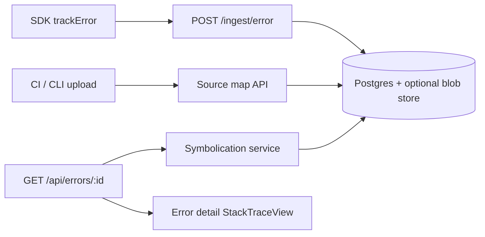

# Source maps (v1.3.0)

Design for **[issue #98](https://github.com/Telemetry-Tracker/telemetry-tracker/issues/98)**: upload source maps per release and show symbolicated stack traces in the error detail view.

## Current state

| Layer | Today |
|-------|--------|
| **Ingest** | `POST /ingest/error` accepts optional `stack` string; SDK sends `release` but API previously dropped it |
| **Storage** | `ErrorGroup.top_stack` (first line), `ErrorOccurrence.stack` (full raw string) |
| **Dashboard** | `StackTraceView` renders plain text — no frame parsing or symbolication |
| **Upload** | No file/binary upload routes |

Events already store `release`; errors must do the same before maps can be keyed.

## Target UX

1. CI or CLI uploads `.map` files keyed by `(project, app, release, bundle path)`.
2. User opens an error occurrence in production; stack shows **original file, line, and function** when a map exists.
3. Toggle **raw** vs **symbolicated** stack; empty state when release has errors but no maps.

## Architecture



### Storage model (Phase 2)

Proposed `SourceMapArtifact` table:

| Column | Purpose |
|--------|---------|
| `project_id` | Tenant scope |
| `app` | SDK app label |
| `release` | Version string (matches error ingest) |
| `bundle_url` | Minified file URL/path the map applies to |
| `content` or `storage_key` | Map JSON (self-host bytea) or object-store key |
| `sha256` | Dedupe / integrity |
| `uploaded_at` | Audit |

Retention: align with plan `retentionDays`; delete artifacts when release data ages out.

### Symbolication (Phase 4)

- Parse V8 / Firefox / Safari stack line formats server-side.
- Resolve `(bundle, line, column)` via [`source-map`](https://www.npmjs.com/package/source-map) or `@jridgewell/trace-mapping`.
- Key lookup: `(project_id, app, release)` → artifacts for bundle path.
- Optional: cache symbolicated frames on `ErrorOccurrence` after first read.

**Fingerprinting:** grouping stays on raw `message + first stack line` (minified). Symbolication is display-only unless we add a separate canonical fingerprint later.

## Implementation phases

| Phase | Scope | Status |
|-------|--------|--------|
| **1** | Persist `release` on errors (ingest, schema, API, dashboard) | In progress — `feature/source-maps-v1` |
| **2** | `SourceMapArtifact` schema + retention | Planned |
| **3** | Upload API (`POST /api/project/source-maps`) + CLI docs | Planned |
| **4** | Symbolication engine + API field `symbolicated_stack` | Planned |
| **5** | Dashboard frame UI, settings/history page | Planned |
| **6** | Quotas, tests, docs, README roadmap ✅ | Planned |

## Phase 1 — release on errors

- Add `release` to `ErrorGroup` and `ErrorOccurrence`.
- Accept `release` in `errorSchema` (SDK already sends it).
- Update group `release` on new occurrences (same pattern as `environment`).
- Show release on error detail meta and per occurrence.

## Phase 3 — upload API (sketch)

```
POST /api/project/source-maps
Authorization: session (EDITOR+)
Content-Type: multipart/form-data

Fields: release, app, file (.map), bundle_url (optional)
```

Alternative for self-host simplicity: JSON body with gzip+base64 map content under size cap.

CLI wrapper (future): `npx @tacko/telemetry-cli upload-sourcemaps --release=1.0.0 ./dist/**/*.map`

## Security

- Upload: session auth + project membership (EDITOR+); rate limit per project.
- Maps may contain source — treat as sensitive; same retention as telemetry.
- Ingest upload via API key (optional): scoped key with `sourcemap:write` if needed later.

## References

- [sdk-core.md](./sdk-core.md) — `trackError`, `release` in payloads
- [ARCHITECTURE.md](./ARCHITECTURE.md) — ingest pipeline
- [ENTITLEMENTS.md](./ENTITLEMENTS.md) — retention by plan tier
