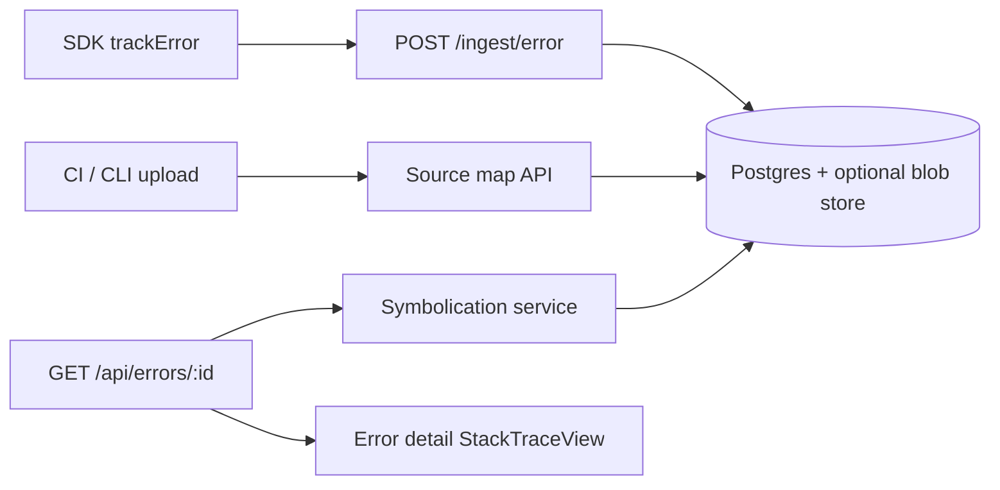

# Source maps (v1.3.0)

Design for **[issue #98](https://github.com/Telemetry-Tracker/telemetry-tracker/issues/98)**: upload source maps per release and show symbolicated stack traces in the error detail view.

## Current state

| Layer | Today |
|-------|--------|
| **Ingest** | `POST /ingest/error` accepts optional `stack` string; SDK sends `release` but API previously dropped it |
| **Storage** | `ErrorGroup.top_stack` (first line), `ErrorOccurrence.stack` (full raw string) |
| **Dashboard** | `StackTraceView` renders plain text — no frame parsing or symbolication |
| **Upload** | `POST/GET /api/project/source-maps` (JSON upload, metadata list); plan quotas per project |
| **Symbolication** | Server-side on `GET /api/errors/:id`; dashboard raw/symbolicated toggle on error detail |

Events already store `release`; errors must do the same before maps can be keyed.

## Target UX

1. CI or CLI uploads `.map` files keyed by `(project, app, release, bundle path)`.
2. User opens an error occurrence in production; stack shows **original file, line, and function** when a map exists.
3. Toggle **raw** vs **symbolicated** stack; empty state when release has errors but no maps.

## Architecture



### Storage model (Phase 2)

Proposed `SourceMapArtifact` table:

| Column | Purpose |
|--------|---------|
| `project_id` | Tenant scope |
| `app` | SDK app label |
| `release` | Version string (matches error ingest) |
| `bundle_url` | Minified file URL/path the map applies to |
| `content` or `storage_key` | Map JSON (self-host bytea) or object-store key |
| `sha256` | Dedupe / integrity |
| `uploaded_at` | Audit |

Retention: align with plan `retentionDays`; the nightly retention job deletes artifacts where `uploaded_at` is older than the project cutoff (same as events/errors).

### Symbolication (Phase 4)

- Parse V8 / Firefox / Safari stack line formats server-side.
- Resolve `(bundle, line, column)` via [`source-map`](https://www.npmjs.com/package/source-map) or `@jridgewell/trace-mapping`.
- Key lookup: `(project_id, app, release)` → artifacts for bundle path.
- Optional: cache symbolicated frames on `ErrorOccurrence` after first read.

**Fingerprinting:** grouping stays on raw `message + first stack line` (minified). Symbolication is display-only unless we add a separate canonical fingerprint later.

## Implementation phases

| Phase | Scope | Status |
|-------|--------|--------|
| **1** | Persist `release` on errors (ingest, schema, API, dashboard) | Done |
| **2** | `SourceMapArtifact` schema + retention | Done |
| **3** | Upload API (`POST /api/project/source-maps`) + CLI docs | Done (JSON upload/list; CLI follow-up) |
| **4** | Symbolication engine + API field `symbolicated_stack` | Done |
| **5** | Dashboard frame UI, settings/history page | Done |
| **6** | Quotas, tests, docs, README roadmap ✅ | Done |

## Phase 1 — release on errors

- Add `release` to `ErrorGroup` and `ErrorOccurrence`.
- Accept `release` in `errorSchema` (SDK already sends it).
- Update group `release` on new occurrences (same pattern as `environment`).
- Show release on error detail meta and per occurrence.

## Phase 2 — storage model

- `SourceMapArtifact` table: unique `(project_id, app, release, bundle_url)`, `content` (TEXT), optional `storage_key`, `sha256`, `size_bytes`, `uploaded_at`.
- Lookup helpers in `apps/api/src/lib/source-map-artifact.ts`.
- Retention sweep deletes stale maps per project plan `retentionDays` (keeps maps when matching in-window errors exist).

## Phase 3 — upload API

**Upload** (EDITOR+ session, active project):

```http
POST /api/project/source-maps
Content-Type: application/json
X-Project-Id: <project-uuid>

{
  "app": "web",
  "release": "1.2.0",
  "bundle_url": "https://cdn.example.com/assets/app.js",
  "content": { "version": 3, "sources": ["..."], "mappings": "..." }
}
```

Returns `201` on create, `200` on replace (same key). Max size: 10 MB (`MAX_SOURCE_MAP_BYTES`). `app` and `release` are trimmed on upload and on all ingest routes so keys align with symbolication and retention.

**List** (any project member with read access):

```http
GET /api/project/source-maps?app=web&release=1.2.0
X-Project-Id: <project-uuid>
```

Returns metadata only (no map body). Implementation: `apps/api/src/lib/source-map-upload.ts`.

Future: multipart upload and CLI wrapper (`npx @telemetry-tracker/cli upload-sourcemaps --release=1.0.0 ./dist/**/*.map`).

## Phase 4 — symbolication

Server-side stack parsing (V8, Firefox-style) and source map lookup by `(project_id, app, release, bundle_url)`.

`GET /api/errors/:id` adds optional fields when maps exist:

- `symbolicated_top_stack` on the error group — first symbolicated frame from the newest occurrence stack (not `top_stack`, which stores the error message line)
- `symbolicated_stack` on each occurrence in `occurrences_list`

Symbolication is display-only; grouping fingerprints stay on raw minified stacks. Implementation: `apps/api/src/lib/stack-symbolicate.ts` (`@jridgewell/trace-mapping`).

## Phase 5 — dashboard UI

- Error detail (`/dashboard/errors/[id]`) — `StackTracePanel` with **Raw / Symbolicated** toggle per occurrence; empty-state hint links to source map settings when release has no maps.
- Settings → **Source maps** (`/dashboard/settings/source-maps`) — list uploaded artifacts by app + release (metadata only).

## Phase 6 — quotas & release prep

- Plan cap: `maxSourceMapArtifactsPerProject` (FREE 25, PRO 250, BUSINESS 2 500). Re-uploading the same `(app, release, bundle_url)` replaces in place and does not consume an extra slot.
- Enforced inside `upsertSourceMapArtifact` (serializable transaction: count + create) on `POST /api/project/source-maps`.
- README and this doc updated; closes implementation scope for [#98](https://github.com/Telemetry-Tracker/telemetry-tracker/issues/98) pending v1.3.0 release promotion.

## Security

- Upload: session auth + project membership (EDITOR+); rate limit per project.
- Maps may contain source — treat as sensitive; same retention as telemetry.
- Ingest upload via API key (optional): scoped key with `sourcemap:write` if needed later.

## References

- [sdk-core.md](./sdk-core.md) — `trackError`, `release` in payloads
- [ARCHITECTURE.md](./ARCHITECTURE.md) — ingest pipeline
- [ENTITLEMENTS.md](./ENTITLEMENTS.md) — retention by plan tier

## GitHub Action Workflow Example

You can automatically upload source maps on every release using our GitHub Action:

```yaml
name: Release Configuration
on:
  release:
    types: [published]

jobs:
  upload-maps:
    runs-on: ubuntu-latest
    steps:
      - uses: actions/checkout@v4
      - name: Upload Source Maps
        uses: ./.github/actions/upload-source-maps
        with:
          session_cookie: ${{ secrets.TT_SESSION_COOKIE }}
          project_id: "your-project-uuid-here"
          release: ${{ github.event.release.tag_name }}
          app: "my-telemetry-app"
          artifact_path: "./dist"
          base_url: "https://example.com"
```
